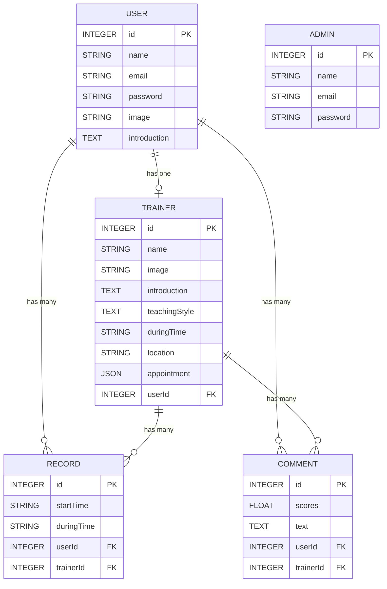

# Workout Booking App 改良方案

## Table of contents

## 1. 現行應用程式介紹
### 1-1.現行架構
- 此應用程式為健身個別課預約系統，多位教練可於系統開課，使用者可透過系統挑選教練並預約時段，給予評分與評論
### 1-2.Database Schema

### 1-3.為何使用關聯式資料庫?
- 預約系統對於讀取有強一致性的需求(Consistency in reads)，更新操作執行成功後，所有的使用者都應該讀取到最新的值，避免重複預約或預約未果
  
## 2. 預設瞬間有高流量(類似高鐵搶票系統、活動促銷期間預約系統)，嘗試思考架構要如何配置、資料庫優化
### 2-1.需求特性描述
- 預期使用者在預約過程中，會頻繁讀取教練可預約的時段(getLesson function)以及寫入預約(postAppointment function)

## 3. 優化整體架構之方案
### 3-1. 使用傳輸效能較佳的通訊協定 HTTP/2
- 相較於HTTP/1.1至多使用六個 TCP 連線，每個連線一次只能傳送一個回應 (response queuing)；HTTP/2改善訊息編碼方式(Binary framing layer)，並用單一TCP連線多工處理(multiplexing)，是此通訊協定提供的所有其他功能以及效能最佳化的基礎
### 3-2. Using Nginx as Layer 7 Reverse Proxy
使用Nginx作為反向代理，提供隱藏server真實IP、負載平衡、應用層防火牆等作用。
- Layer 7 load balancer
解析packet中資料內容，依照request為GET或POST、PUT、DELETE請求，分流至相應處理的server，減輕流量壓力

- TLS Termination Proxy
流量來自於各種不同國家(不同位址)的Client端，故於Client端至Reverse Proxy端採用TLS 1.3，而Reverse Proxy端至後端server內網通訊採用http。此設計可提供入侵檢測(Intrusion Detection System)偵測DDoS攻擊、減輕Reverse Proxy端至後方server端加密解密負擔，增加通訊效率

- Transport Layer Security 1.3
相較於TLS1.2(使用對稱加密)，TLS 1.3使用Diffie–Hellman金鑰交換，為非對稱加密(asymmetric encryption)，並簡化通訊流程，增加安全性以及提升傳輸效率