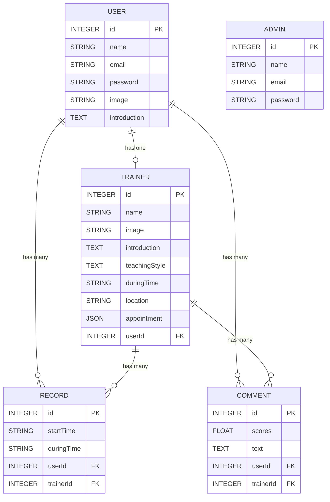

# Workout Booking App - Improvement Plan  

## Table of contents

## 1. 現行應用程式介紹
### 1-1.現行架構
- 此應用程式為健身個別課預約系統，多位教練可於系統開課，使用者可透過系統挑選教練並預約時段，給予評分與評論  

<div align="center">

</div>

### 1-2.Database Schema

### 1-3.為何使用關聯式資料庫?
- 預約系統對於讀取有強一致性的需求(Consistency in reads)，更新操作執行成功後，所有的使用者都應該讀取到最新的值，避免重複預約或預約未果
  
## 2. 預設瞬間有高流量(類似高鐵搶票系統、活動促銷期間預約系統)，嘗試思考架構要如何配置、資料庫優化
### 2-1.需求特性描述
- 預期使用者在預約過程中，會頻繁讀取教練可預約的時段(getLesson function)以及寫入預約(postAppointment function)

## 3. 優化整體架構之方案
### 3-1. 使用傳輸效能較佳的通訊協定 HTTP/2
- 相較於HTTP/1.1至多使用六個 TCP 連線，每個連線一次只能傳送一個回應 (response queuing)；HTTP/2改善訊息編碼方式(Binary framing layer)，並用單一TCP連線多工處理(multiplexing)，是此通訊協定提供的所有其他功能以及效能最佳化的基礎
### 3-2. Using Nginx as Layer 7 Reverse Proxy
使用Nginx作為反向代理，提供隱藏server真實IP、負載平衡、應用層防火牆等作用。  

<div align="center">

</div>

- Layer 7 load balancer  
解析packet中資料內容，依照request為GET或POST、PUT、DELETE請求，分流至相應處理的server，減輕流量壓力

- TLS Termination Proxy  
流量來自於各種不同國家(不同位址)的Client端，故於Client端至Reverse Proxy端採用TLS 1.3，而Reverse Proxy端至後端server內網通訊採用http。此設計可提供入侵檢測(Intrusion Detection System)偵測DDoS攻擊、減輕Reverse Proxy端至後方server端加密解密負擔，增加通訊效率

- Transport Layer Security 1.3  
相較於TLS1.2(使用對稱加密)，TLS 1.3使用Diffie–Hellman金鑰交換，為非對稱加密(asymmetric encryption)，並簡化通訊流程，增加安全性以及提升傳輸效率  

### 3-3. Query設定索引Index  
- MySQL InnoDB預設使用clustered Index，以B+ tree作為實際資料儲存結構，對Primary key做索引，並將整個row儲存於leaf nodes；自行建立的索引為secondary Index，leaf nodes僅存有對應Primary key  
- 依據需求特性，高頻率query的功能與索引方案如下:  
  - **(1) function getLessons**:  
  ```javascript
  getLessons: async (req, cb) => {
    try {
      const today = timeTool.currentTaipeiTime()
      const DEFAULT_LIMIT = 8
      const page = Number(req.query.page) || 1
      const limit = Number(req.query.limit) || DEFAULT_LIMIT
      const offset = getOffset(limit, page)

      const [findTrainers, findUserRecord] = await Promise.all([
        Trainer.findAndCountAll({
          limit,
          offset,
          raw: true
        }),
        Record.findAll({
          where: { startTime: { [Op.lt]: today } },
          include: [{ model: User, attributes: ['name', 'image'] }],
          attributes: [
            'user_id',
            [Sequelize.fn('sum', Sequelize.col('during_time')), 'totalTime']
          ],
          group: ['user_id'],
          order: [
            [Sequelize.fn('sum', Sequelize.col('during_time')), 'DESC']
          ],
          limit: 10,
          raw: true
        })
      ])

      const trainers = findTrainers.rows.map(t => ({
        ...t,
        introduction: t.introduction && t.introduction.length ? `${t.introduction.substring(0, 50)}...` : '',
        teachingStyle: t.teachingStyle && t.teachingStyle.length ? `${t.teachingStyle.substring(0, 50)}...` : ''
      }))

      const userRecordRank = rankTool.addRankIndex(findUserRecord)

      cb(null, { trainers, userRecordRank, pagination: getPagination(limit, page, findTrainers.count) })
    } catch (error) {
      cb(error)
    }
  }
  ```
  此功能需要取得過去時間所有預約紀錄，做分組統計並排序，故欲取得資料量占整體比例高，故設立索引效用不大。索引適用於需要在大量資料中，取得特定條件的少量資料。  
  

  - **(2) function getLesson**:  
  ```javascript
  getLesson: async (req, cb) => {
    try {
      const { trainerId } = req.params
      const todayAddOne = dayjs(timeTool.currentTaipeiTime()).add(1, 'day').format('YYYY-MM-DD')
      const [trainer, findRecord, allComments, avgCommentScore] = await Promise.all([
        Trainer.findByPk(trainerId, { raw: true }),
        Record.findAll({
          where: {
            trainerId,
            startTime: { [Op.gte]: todayAddOne }
          },
          raw: true
        }) || [],
        Comment.findAll({
          where: { trainerId },
          order: [['scores', 'DESC']],
          raw: true
        }),
        Comment.findOne({
          where: { trainerId },
          attributes: [
            [Sequelize.fn('AVG', Sequelize.col('scores')), 'avgScores']
          ],
          raw: true
        })
      ])

      if (!trainer) throw new Error("Trainer didn't exist!")

      // 計算目前此教練可以被預約的時間
      const bookedRecord = findRecord.map(r => r.startTime)
      if (typeof (trainer.appointment) !== 'object') {
        const newArray = []
        newArray.push(trainer.appointment)
        trainer.appointment = newArray
      }
      trainer.availableReserveTime = timeTool.availableReserve(trainer.appointment, bookedRecord, trainer.duringTime)
      // 最佳評論、最差評論、平均分數
      avgCommentScore.avgScores = parseFloat(avgCommentScore.avgScores).toFixed(1)
      const highComment = allComments[0]
      const lowComment = allComments.length > 1 ? allComments[allComments.length - 1] : null

      cb(null, { trainer, highComment, lowComment, avgCommentScore })
    } catch (error) {
      cb(error)
    }
  }
  ```
  此功能主要為計算每位教練的可預約時段，故關鍵的資料為教練開課星期(Table Trainer-appointment)、課程長度(Table Trainer - duringTime)、已經預約的時段(Table Record - startTime)，以及提供教練的評價資訊(Table Comment- scores、text)。  

  | 所需資料 | 索引策略 | 搜尋運行流程 |
  | --- | --- | --- |
  | 教練開課星期(Table Trainer-appointment)、課程長度(Table Trainer - duringTime) | 不另設索引 | 運用原mysql所建立之clustered Index即可找到資料 |
  | 教練已經預約的時段(Table Record - startTime) | Table Record設立Compound index(trainer_id, startTime)；startTime改為使用資料庫內建日期時間資料型態，避免使用字串| 此連合索引會以左側trainer_id建立，將startTime欄位與原資料PK儲存於leaf nodes。故可直接於該索引，運用trainer_id取得startTime資料(不用回到clustered Index取得full row)，再於應用程式面處理startTime排序與取得未來日期 |
  | 教練的評價資訊(Table Comment- scores、text) | Table Comment設立Covering index(trainer_id) | 先至trainer_id的secondary index搜尋，再至clustered Index取得full row |  

  - **(3) function postAppointment**:
  ```javascript
  postAppointment: async (req, cb) => {
    const userId = req.user.id
    const { trainerId, appointment } = req.body
    const startTime = timeTool.appointmentFormat(appointment)
    try {
      if (!trainerId || !appointment) throw new Error('All fields are required')

      const [trainer, userRecord, trainerRecord] = await Promise.all([
        Trainer.findByPk(trainerId, { raw: true }),
        Record.findAll({ where: { userId }, raw: true }),
        Record.findAll({ where: { trainerId }, raw: true })
      ])
      // 前端資料驗證
      if (!trainer) throw new Error("Trainer didn't exist!")
      if (parseInt(trainer.userId) === parseInt(userId)) throw new Error("Unable to book a trainer's own lesson")
      if (!timeTool.startTimeAvailable(startTime, trainer.appointment)) throw new Error('Not open during this week day')
      // 確認此預約是否與trainer的其他user預約重複(同trainer)
      if (timeTool.bookedCheck(startTime, trainerRecord)) throw new Error('This time slot has been reserved')
      // 確認此預約是否與user自己的其他預約重複(同user)
      if (timeTool.userOverlappingCheck(startTime, trainer.duringTime, userRecord)) throw new Error('User appointments overlap')

      // 創建新預約
      const newRecord = await Record.create({
        startTime,
        duringTime: trainer.duringTime,
        userId,
        trainerId: trainer.id
      })
      cb(null, { record: newRecord })
    } catch (error) {
      cb(error)
    }
    }
  ```
  此功能為新增預約，需要使用者與教練目前的預約紀錄檢核是否有預約衝突，故所需要的關鍵資料為教練開課星期(Table Trainer - appointment)、課程長度(Table Trainer - duringTime)、教練及使用者已預約資訊(Table Record - startTime、duringTime)，故新增索引:  

  | 所需資料 | 索引策略 | 搜尋運行流程 |
  | --- | --- | --- |
  | 使用者已預約資訊(Table Record - startTime、duringTime) | Table Record設立Covering index(user_id) | 先至user_id的secondary index搜尋，再至clustered Index取得full row |  

### 3-4. DB-Horizontal partitioning (in the same database)  
- Table Record、Table Comment不適合使用資料表水平切分，因搜尋資料時會經常使用user_id與trainer_id兩個欄位為條件，若使用兩者其中一個欄位進行水平切分，將會使符合另一個欄位條件的資料分散於多個不同分區(partition)  
- Table User適合使用user_id進行資料水平切分；Table Trainer適合使用trainer_id進行資料水平切分  
  
<div align="center">

</div>
  
### 3-5. DB-Master-Standby Replication  
- 使用兩個MySQL instance，一個instance做為Master database server進行資料寫入(W)，另一個instance進行Replication作為Standby database server僅進行資料讀取(R)  
- 使用synchronous replication，確保Master與Standby database裡資料的一致性，但會影響資料寫入速度  
  
<div align="center">

</div>
  
### 3-6. Using Redis as Cache  
- Redis會將所有資料存放於記憶體(In-Memory Database)，單線程架構(single thread)，資料儲存方式為key-value，讀寫速度快，適合做為緩存服務  
- 適合緩存的資料應符合「**高頻率使用**」以及「**不常被更新**」，故此專案中，Table User與Table Trainer資料適合緩存。原因如下述，此應用程式為Stateless Application，使用token做為用戶驗證機制，每一個request都會需要至資料庫讀取Table User，且會員資料(user)正常情況不會頻繁更新；Table Trainer資料內容為教練的個人簡介、開課資訊等，初期擬訂後不會頻繁更動，且此應用程式首頁、預約頁面皆會頻繁使用教練資料(trainer)  
- 為維持資料庫與緩存資料一致性，將使用**Cache Aside緩存策略**。資料異動時，先寫入Master database後，資料複製到Standby database，再刪除Redis緩存，當讀取cache miss，再到資料庫讀取並重新建立緩存、設定key的EXPIRE  
  
<div align="center">

</div>
  
### 3-7. Sharding (multiple database servers)  
- Sharding利於水平擴展，但將會使維持關聯式資料庫中的ACID變得非常複雜，包含多個server需要處理寫入衝突、Join處理、Rollback等，必須謹慎思考其必要性，應為最後選項。  
- 其他優先解決方案傾向於單庫操作、一庫寫多庫讀(通常為讀取需求大)；若是寫入需求真的很大，考慮兩個資料庫寫入(Master-Master Replication)，但兩個寫入資料庫架設於不同地理分區(例如美東與美西)，減少寫入衝突。  
  
## 4. 優化layer 7之方案